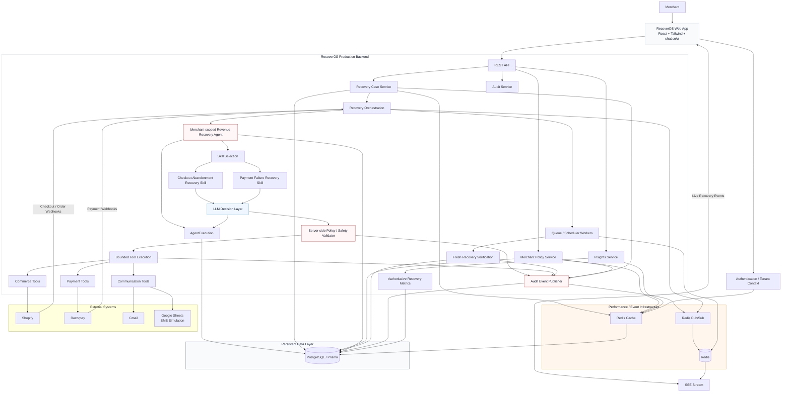

# RecoverOS

> **RecoverOS is a production-oriented autonomous revenue recovery system for merchants.**
>
> It detects revenue at risk, determines a bounded intervention using a merchant-scoped recovery agent, executes only policy-approved actions, verifies the outcome using fresh external evidence, and records an auditable recovery journey.

## Table of Contents

- [What We Are Solving](#what-we-are-solving)
- [Why Existing Recovery Flows Are Not Enough](#why-existing-recovery-flows-are-not-enough)
- [What RecoverOS Does](#what-recoveros-does)
- [Production Architecture](#production-architecture)
- [Core Recovery Flow](#core-recovery-flow)
- [Merchant-Scoped Agent Architecture](#merchant-scoped-agent-architecture)
- [Recovery Skills](#recovery-skills)
- [Shopify + Razorpay Correlation](#shopify--razorpay-correlation)
- [Policy and Safety Boundaries](#policy-and-safety-boundaries)
- [Recovery Verification](#recovery-verification)
- [Reliability and Idempotency](#reliability-and-idempotency)
- [Caching and Event Infrastructure](#caching-and-event-infrastructure)
- [Auditability and Observability](#auditability-and-observability)
- [Data Architecture](#data-architecture)
- [Real-Time Merchant Experience](#real-time-merchant-experience)
- [Production Design Principles](#production-design-principles)
- [Technology Stack](#technology-stack)
- [Security](#security)
- [Failure Handling](#failure-handling)
- [Project Status](#project-status)

## What We Are Solving

Merchants lose revenue across multiple points in the customer journey:

- A customer starts a checkout but does not complete it.
- A payment attempt fails.
- A recovery opportunity exists, but conventional automation cannot determine the appropriate next action.
- Follow-ups continue after a customer has already recovered.
- Commerce and payment systems contain different pieces of the same journey.
- Automated actions can become unsafe when they are not constrained by merchant policy or verified against the latest state.

Traditional automation is often a fixed rule such as:

> "If checkout is abandoned, send an email after X minutes."

RecoverOS treats the problem as a **bounded recovery journey** rather than a set of disconnected automations.

The system maintains a recovery case, selects the appropriate recovery skill, lets a merchant-scoped agent determine an intervention, validates that intervention against server-side policy, executes only bounded tools, and verifies whether recovery actually happened.

The objective is not simply to send more messages or discounts.

The objective is to answer:

> **How much revenue is at risk, what is the safest useful intervention, did it work, and when should the system stop?**

## Why Existing Recovery Flows Are Not Enough

A recovery system operating across commerce and payments has several difficult properties.

### Multiple systems represent different parts of the journey

Shopify may know about checkout and order state while Razorpay knows about payment state. Neither system should automatically be assumed to describe the complete customer journey.

### Recovery is stateful

A recovery attempt can contain multiple actions:

```text
Opportunity
   ↓
Agent Decision
   ↓
Policy Validation
   ↓
Intervention
   ↓
Follow-up
   ↓
Fresh Verification
   ↓
Recovered / Continue / Stop
```

The system must preserve that state across asynchronous workers, retries, webhooks, and follow-ups.

### Autonomous decisions need hard boundaries

The LLM can recommend an intervention, but it must not become the final authority over:

- merchant limits
- discount ceilings
- communication limits
- permitted recovery channels
- tenant isolation
- financial tool execution
- recovery completion

Those constraints belong to deterministic server-side controls.

### Action completion is not recovery

A message being sent does not mean a sale happened.

A discount being created does not mean an order was completed.

A payment link being generated does not mean payment succeeded.

RecoverOS therefore separates **intervention execution** from **fresh recovery verification**.

## What RecoverOS Does

### 1. Detect

Signals arrive from supported systems such as Shopify and Razorpay.

Examples include:

- Shopify checkout updates
- Shopify order events
- Razorpay payment events

### 2. Create or update a recovery case

The system resolves incoming events into a merchant-scoped `RecoveryCase`.

The case acts as the canonical business-level representation of the recovery journey.

### 3. Select a recovery skill

The merchant does not build agents or configure prompts.

RecoverOS provisions a predefined merchant-scoped Revenue Recovery Agent with system-owned skills.

### 4. Decide

The appropriate recovery skill supplies case context to the LLM decision layer.

The model proposes a bounded intervention and rationale.

### 5. Validate

The server validates the proposed action against merchant policy and system safety rules.

### 6. Execute

Only explicitly bounded tools can perform external actions.

Examples include:

- communication
- Shopify recovery discounts
- Razorpay payment recovery links

### 7. Follow up

The system schedules bounded follow-up work using asynchronous workers.

### 8. Verify

At execution time, the system checks fresh external evidence.

Possible outcomes are:

```text
RECOVERED
NOT_RECOVERED
VERIFICATION_UNAVAILABLE
UNKNOWN
```

### 9. Stop or continue

The recovery journey either confirms recovery, continues within policy boundaries, or remains in a safe state when verification is unavailable or ambiguous.

## Production Architecture



> **Persistence note:** PostgreSQL is the persistent source of truth. Redis is used for hot-path caching and runtime coordination. Redis cache state and Pub/Sub messages are not the authoritative business record.

## Core Recovery Flow

```text
External Event
     │
     ▼
Webhook / API Ingestion
     │
     ▼
Tenant + Context Resolution
     │
     ▼
Recovery Case
     │
     ▼
Async Worker / Scheduler
     │
     ▼
Merchant-scoped Revenue Recovery Agent
     │
     ▼
Skill Selection
     │
     ▼
LLM Decision
     │
     ▼
Server-side Policy / Safety Validation
     │
     ├──────────── blocked ────────────► Audit + Stop
     │
     ▼
Bounded Tool Execution
     │
     ▼
Follow-up / Verification Schedule
     │
     ▼
Fresh External Verification
     │
     ├──► RECOVERED
     ├──► NOT_RECOVERED
     ├──► VERIFICATION_UNAVAILABLE
     └──► UNKNOWN
```

This separation keeps decisioning, execution, persistence, and verification independently controllable.

## Merchant-Scoped Agent Architecture

RecoverOS does **not** expose an unrestricted Agent Builder to merchants.

Instead, the platform owns the recovery architecture.

For each merchant, a predefined Revenue Recovery Agent is provisioned with:

- supported recovery skills
- supported actions
- stop conditions
- merchant policy constraints
- connected capabilities

The merchant configures policy and integrations, while the system controls the underlying agent architecture.

```text
Merchant
   │
   ├── Integrations
   ├── Recovery Policy
   └── Communication Channels
             │
             ▼
     Merchant-scoped Agent
             │
             ├── Checkout Abandonment Skill
             └── Payment Failure Skill
```

The agent does not receive unrestricted authority over external systems. Its proposed action must pass deterministic validation before execution.

## Recovery Skills

### Checkout Abandonment Recovery

Used when a checkout represents an active recovery opportunity without completed-order evidence.

The skill operates on checkout context and can use bounded commerce and communication actions.

Typical intervention categories include:

- recovery communication
- bounded recovery discount
- follow-up

### Payment Failure Recovery

Used for payment-failure journeys.

This skill is intentionally separated from checkout abandonment recovery because a failed payment is a different recovery condition and should not automatically be treated as marketing abandonment.

Typical intervention categories include:

- payment recovery communication
- bounded payment recovery link
- follow-up

The skill is selected from trusted trigger and case context rather than being chosen arbitrarily by the model.

## Shopify + Razorpay Correlation

A key production challenge is that **a Shopify checkout and a Razorpay payment do not necessarily have a deterministic cross-system correlation**.

The systems can expose different identifiers and different views of the customer journey.

```text
Shopify Checkout
       │
       │  no trusted shared identifier
       │
       X
       │
Razorpay Payment
```

### No correlation should be invented

RecoverOS must not assume that a Razorpay payment belongs to a Shopify checkout merely because:

- the amount is similar,
- the email looks similar,
- the phone number looks similar,
- timestamps are close.

Those signals are not equivalent to a trusted cross-system identifier.

### Deterministic identity has priority

Where a trusted shared identity or merchant-controlled correlation exists, that relationship can be used as the authoritative link.

### Heuristic correlation is bounded

When deterministic correlation is unavailable, RecoverOS can use an explicitly bounded heuristic path under system controls.

The important production principle is:

> **Insufficient evidence must result in no confident correlation rather than an invented relationship.**

Ambiguous events should remain separate or unresolved rather than being attached to the wrong recovery case.

This prevents false recovery attribution and incorrect customer journeys.

## Policy and Safety Boundaries

The LLM is a decision component, not the final authority.

The server-side validator enforces merchant policy before external actions are executed.

Important boundaries include:

### Recovery window

A recovery case cannot continue indefinitely.

### Communication limits

Merchant-defined daily communication limits constrain outreach frequency.

### Enabled recovery types

The merchant controls which recovery journeys are enabled.

### Discount ceiling

A merchant-defined maximum discount is enforced server-side.

The current discount state is persisted with the recovery journey so a later decision cannot silently reset or bypass the previous intervention level.

The invariant is:

```text
previous applied discount
        ≤
requested discount
        ≤
merchant maximum discount
```

The model may choose a value within that valid range, but it cannot exceed the server-enforced maximum.

### Tool allowlisting

The agent can only reach external systems through bounded tools explicitly supported by RecoverOS.

## Recovery Verification

A production recovery system must distinguish:

```text
Intervention executed
        ≠
Revenue recovered
```

RecoverOS therefore performs fresh verification at execution time.

For commerce recovery, Shopify is checked for current order evidence.

For payment recovery, Razorpay is checked for current payment evidence when applicable.

The verification layer returns semantic outcomes:

| State | Meaning |
|---|---|
| `RECOVERED` | Fresh evidence confirms recovery |
| `NOT_RECOVERED` | Fresh evidence confirms recovery did not occur |
| `VERIFICATION_UNAVAILABLE` | External verification could not be completed safely |
| `UNKNOWN` | Evidence is ambiguous |

The system does not mark a journey as recovered solely because an intervention API call succeeded.

## Reliability and Idempotency

Recovery workflows operate asynchronously and must tolerate retries, duplicate webhooks, stale jobs, and concurrent workers.

### Idempotent case creation

Repeated events should not create multiple representations of the same recovery opportunity when trusted identity indicates the same journey.

### Execution idempotency

Agent executions use durable identifiers and database constraints to prevent duplicate execution for the same trigger.

### Scheduling protection

Scheduled work is claimed using coordination state and locks so competing workers do not execute the same recovery step concurrently.

### Stale-job protection

A delayed job must re-check current state before acting.

A scheduled follow-up must not proceed when the customer has already recovered.

### Fresh execute-time verification

Workers do not assume that the state from when a job was scheduled is still true when that job actually runs.

## Caching and Event Infrastructure

Redis is used as a performance and coordination layer rather than as the authoritative database.

### Cache

Frequently accessed state can be cached to reduce repeated PostgreSQL reads.

Examples include hot recovery data, policy data, insight-related reads, and tenant/runtime state.

```text
Application
   │
   ├── Redis cache lookup ──► hit ──► continue without DB read
   │
   └── miss ──► PostgreSQL
                  │
                  └── refresh Redis cache
```

The exact cache strategy can vary by service, but the architectural rule remains:

> **Cache improves latency and database load; PostgreSQL owns business truth.**

### Runtime coordination

Redis is also used for short-lived operational state such as:

- locks
- deduplication
- debounce state
- scheduling coordination
- transient worker coordination

### Redis Pub/Sub

Redis Pub/Sub provides live recovery-event fan-out:

```text
Recovery Event
      │
      ▼
Audit Event Publisher
      │
      ├──► PostgreSQL  (persistent audit)
      │
      └──► Redis Pub/Sub
                    │
                    ▼
               SSE Stream
                    │
                    ▼
              Merchant Web App
```

Redis Pub/Sub is a live transport and is not used as the durable event history.

## Auditability and Observability

Meaningful recovery transitions are represented as first-class audit events.

Examples include:

- recovery case creation
- case status changes
- agent started
- agent decision
- policy validation
- policy block
- communication sent
- discount created
- payment link created
- follow-up scheduled
- recovery verification completed
- recovery confirmed
- recovery stopped

The audit model is designed to answer:

> **What happened, what action was attempted, what was allowed, and what happened afterward?**

The merchant UI exposes human-readable activity rather than internal identifiers or raw execution metadata.

The system does not expose hidden model reasoning or chain-of-thought.

## Data Architecture

PostgreSQL is the persistent source of truth for durable recovery state.

Important persisted concepts include:

```text
Merchant / Tenant
    │
    ├── Agent
    │     ├── Skills
    │     ├── Policy
    │     └── Connections
    │
    ├── RecoveryCase
    │     ├── recovery state
    │     ├── revenue at risk
    │     └── journey state
    │
    ├── AgentExecution
    │
    ├── RecoveryAction
    │
    ├── Outcome
    │
    └── AuditEvent
```

The data model separates:

- the recovery opportunity,
- agent execution,
- individual interventions,
- recovery outcome,
- and audit history.

This separation makes the system easier to retry, inspect, and report on.

## Real-Time Merchant Experience

The merchant web application uses REST for durable state and SSE for live recovery events.

### REST

Used for:

- initial dashboard state
- case details
- policies
- insights
- audit history
- integration state

### SSE

Used for live event delivery such as:

```text
Case Created
     ↓
Agent Started
     ↓
Agent Decision
     ↓
Policy Validated
     ↓
Intervention Executed
     ↓
Follow-up Scheduled
     ↓
Recovery Verified
```

REST remains the source of truth for the UI.

SSE is a live update mechanism, not a replayable event store.

## Production Design Principles

RecoverOS is designed around the following production principles.

### 1. Persistent source of truth

PostgreSQL owns durable business state.

Redis improves performance and coordination but does not replace the database.

### 2. Bounded autonomy

The LLM can recommend actions, but deterministic server-side validation controls what can actually happen.

### 3. Asynchronous execution

Long-running recovery work is handled by workers and schedulers rather than blocking request/response paths.

### 4. Idempotency by design

Webhooks, workers, and recovery triggers are expected to be retried.

Duplicate delivery is treated as a normal distributed-systems condition.

### 5. Tenant isolation

Merchant context is carried through request, recovery, integration, and execution layers.

An event or external object must not leak into another merchant's recovery state.

### 6. Fresh-state decisions at execution time

A decision that was correct earlier may become invalid before execution.

Workers reload authoritative state and verify critical conditions at execution time.

### 7. Explicit uncertainty

The system does not convert missing evidence into a confident recovery result.

`UNKNOWN` and `VERIFICATION_UNAVAILABLE` are valid states.

### 8. Separate execution from outcome

A successful provider API call is not treated as proof of business success.

### 9. Durable audit trail

Recovery events are persisted independently from the live-event path.

A real-time delivery problem must not destroy the durable audit record.

### 10. Performance without sacrificing correctness

Redis caching reduces repeated database reads while PostgreSQL remains authoritative.

### 11. Clear provider boundaries

Shopify, Razorpay, Gmail, and other external systems are accessed through explicit integration and tool boundaries rather than being embedded directly into agent reasoning.

### 12. Human-readable operational state

The merchant experience focuses on recovery journeys, interventions, and outcomes rather than internal implementation details.

## Technology Stack

### Frontend

- React
- Tailwind CSS
- shadcn/ui
- REST API
- Server-Sent Events (SSE)

### Backend

- Node.js
- REST API
- asynchronous workers / scheduler
- recovery orchestration
- predefined recovery skills
- LLM decision layer
- server-side policy and safety validation

### Persistence

- PostgreSQL
- Prisma ORM

### Runtime Infrastructure

- Redis Cache
- Redis Pub/Sub
- Redis-based coordination / transient state

### Integrations

- Shopify
- Razorpay
- Gmail
- Google Sheets for the SMS integration path

## Security

Security is documented separately from the main architecture document.

See [SECURITY.md](SECURITY.md).

The security document covers the intended security model, including authentication, authorization, tenant isolation, secret handling, provider credentials, input validation, webhook security, and related controls.

## Failure Handling

Failure behavior is documented separately.

See [FAILURES.md](FAILURES.md).

The failure document covers provider failures, webhook retries, worker failures, duplicate events, verification failures, stale recovery schedules, ambiguous correlation, partial execution, and safe recovery behavior.

## Project Status

RecoverOS is designed as a production-oriented autonomous revenue recovery system.

The core architecture follows:

```text
Detect
  ↓
Understand
  ↓
Decide
  ↓
Validate
  ↓
Execute
  ↓
Verify
  ↓
Recover / Continue / Stop
```

The defining architectural principle is:

> **Autonomous recovery should be powerful enough to act, but constrained enough to remain predictable, auditable, and safe.**
